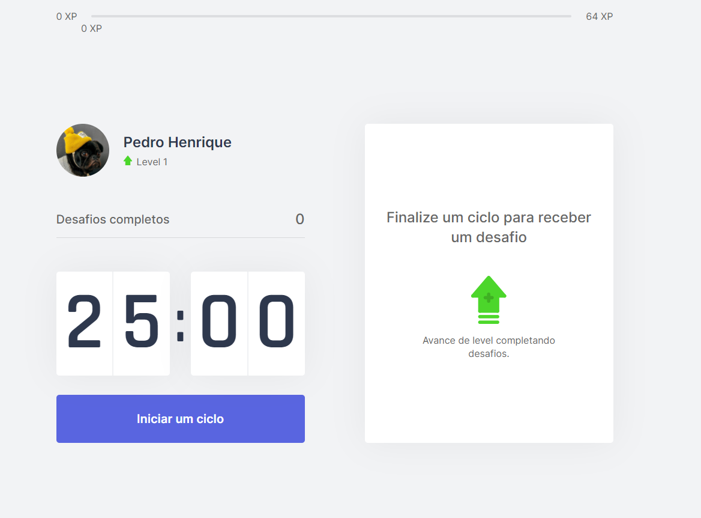
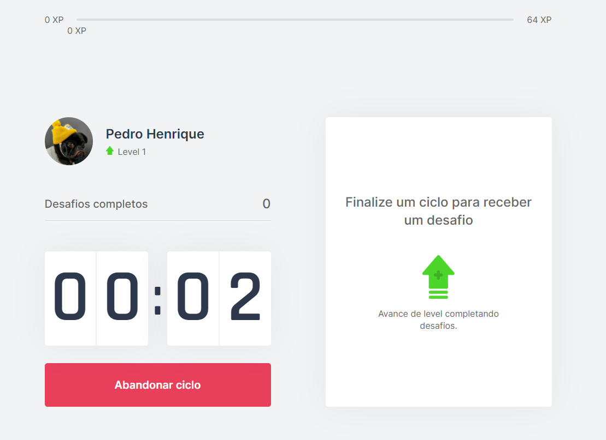
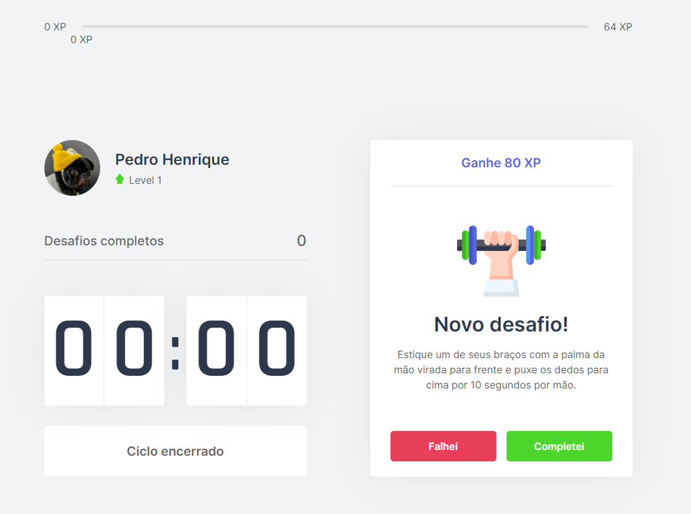
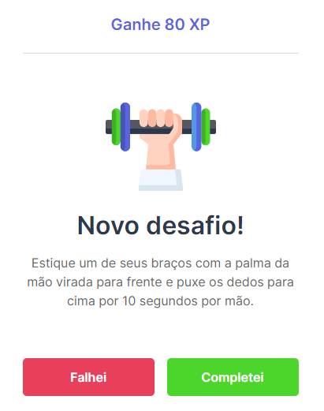

<h1 align="center">
    move.it | NLW#4
</h1>
<p align="center"> Application developed in the fourth edition of Rocketseat Next Level Week 💻🚀 </p>

<p align="center">
 <a href="#objective">Objective</a> •
 <a href="#technologies">Technologies</a> • 
 <a href="#usage">Usage</a> • 
 <a href="#contribution">Contribution</a> • 
 <a href="#author">Author</a> • 
 <a href="#license">License</a>
</p>

<h1 align="center">
  
<div style="display: flex; flex-direction: row;">
  
  
  <div>
  <div style="display: flex; flex-direction: row;">
  
  
  <div>
</h1>

<h4 align="center"> 
	🚧 move.it | NLW#4 ⏰📈 Loading...  🚧
</h4>

<h2 id="objective" > 🎯 Objective </h2>

Track your time, be more productive and take care of your health. <a href="https://timeup.vercel.app">TimeUp</a> was developed for time management, as in the pomodoro technique, dividing the work into 25 minute periods. After that time it releases a challenge, which is some stretching for the body or exercise for the eyes. Each challenge has its xp points and, accumulating the points you level up.

The layout of original move.it is available <a href="https://www.figma.com/file/ge20pu3ofMOKoliUyKx1Nl/?viewer=1&node-id=">here</a>.

<h2 id="technologies"> 🛠 Technologies </h2>

The following tools were used in the construction of the project:

- [ReactJS](https://reactjs.org)
- [NextJS](https://nextjs.org)
- [NodeJS](https://nodejs.org/en/)
- [Yarn](https://yarnpkg.com) or NPM
- [VSCode](https://code.visualstudio.com)
- [Git Bash](https://gitforwindows.org/)

<h2 id="usage" > 👷 Usage </h2>

Required! Install git, node and yarn (or npm).

```bash
# Clone Repository
$ git clone https://github.com/pedroribeiroo/moveit.git

# Go to server folder
$ cd moveit

# Install Dependencies
$ yarn

# Run Aplication
$ yarn dev

# Access localhost
http://localhost:3000
```

<h2 id="contribution"> 🤝 Contribution </h2>

This project is for study purposes too!

<h2 id="author"> 💻 Author </h2>


By Pedro Ribeiro with 💙 Enjoy it!

<h2 id="license"> 📝 License </h2>

This project is under the MIT license.
